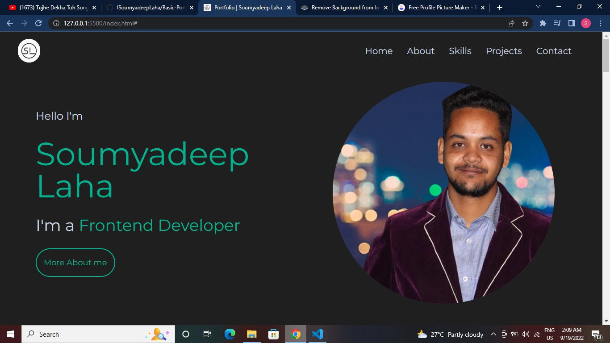
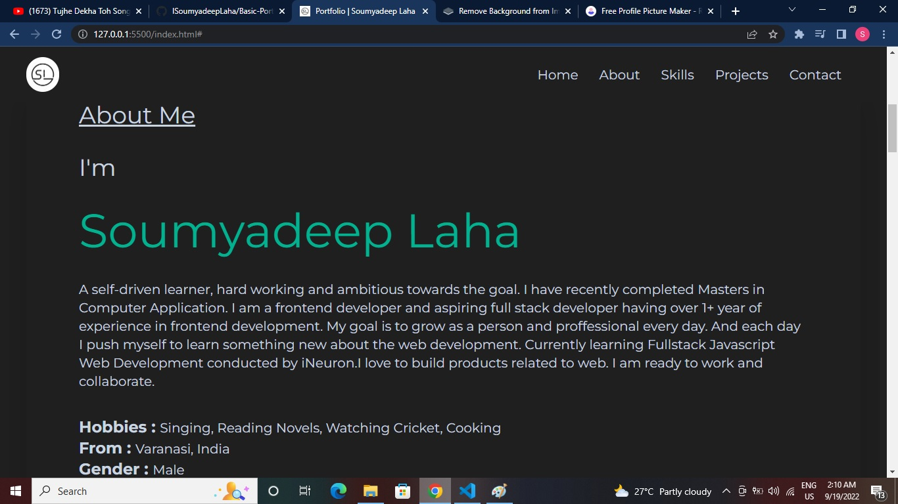
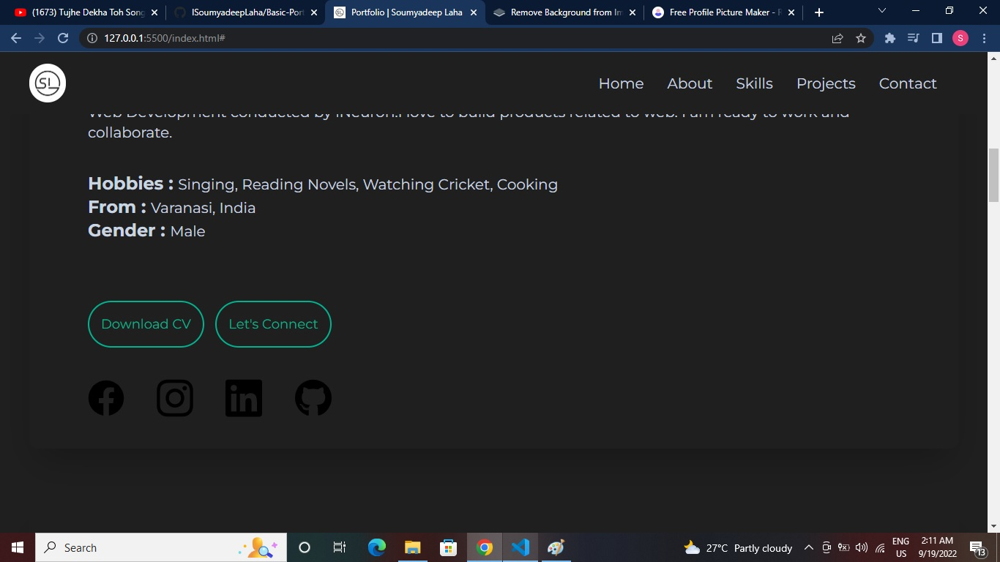
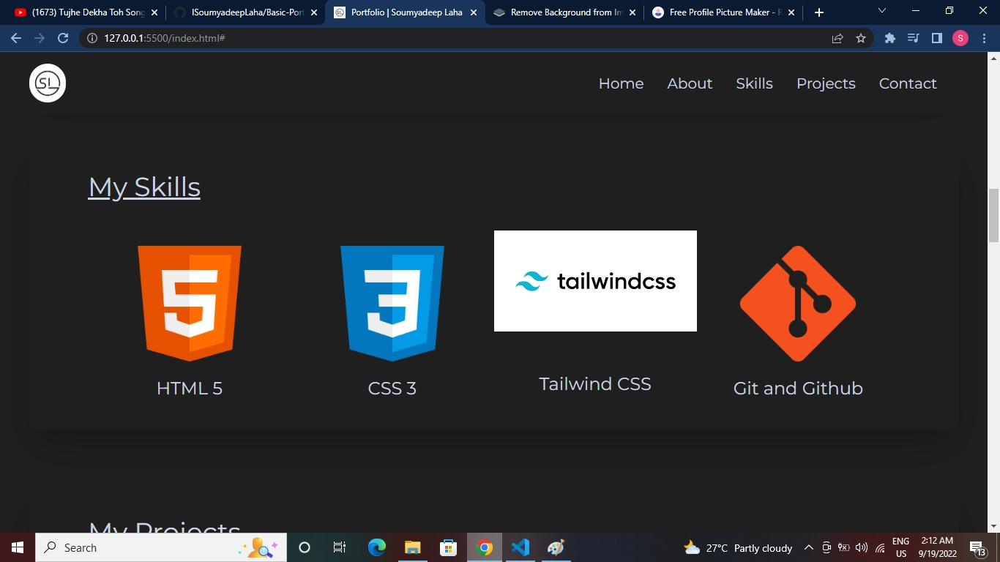
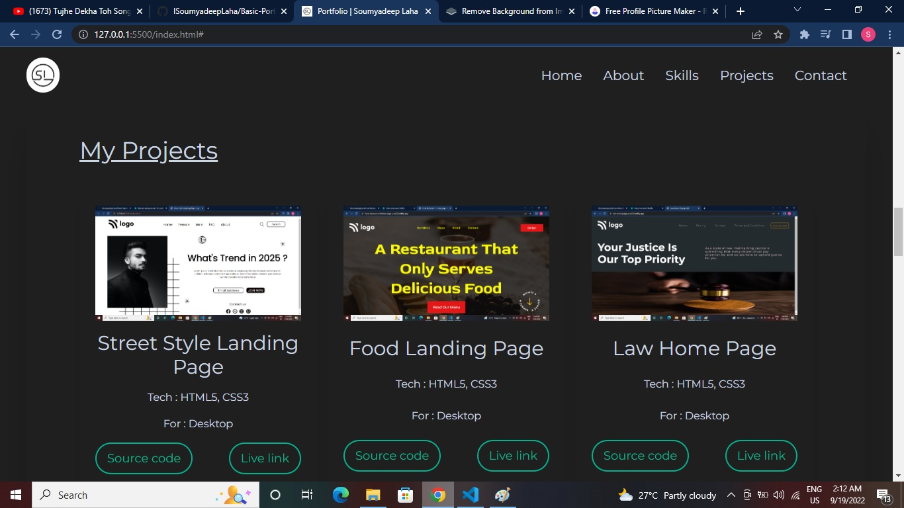
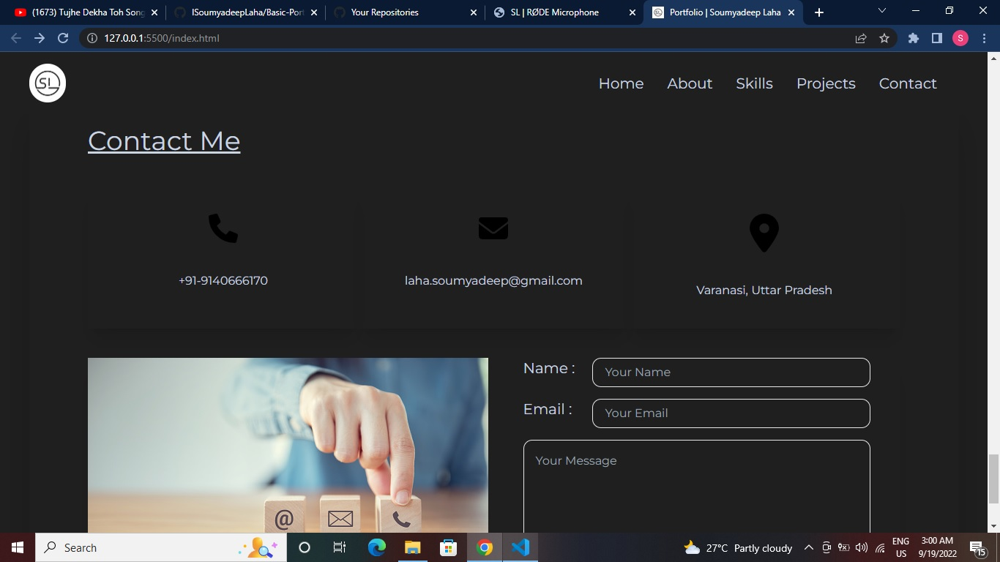
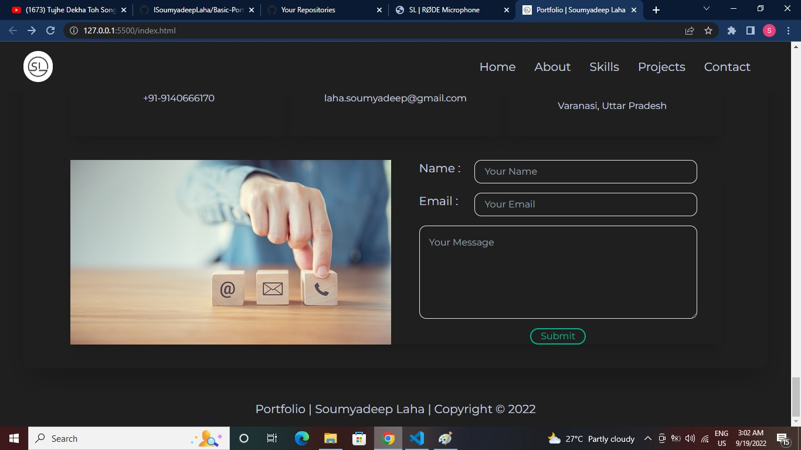

# Portfolio Project using HTML + TailwindCSS

By Soumyadeep Laha

# Key Learnings

- How to create a toggle navbar in mobile responsive view.
- Created some beautiful card using tailwind CSS.
- How to create beautiful sticky navbar.

# Time to complete

The design tooked me around 2 hrs 15 mins, but the total project tooked around 10 to 12 hrs

# Screen Sorts

# Live Link

[Netlify Link...](https://soumyadeeplaha.netlify.app/)

